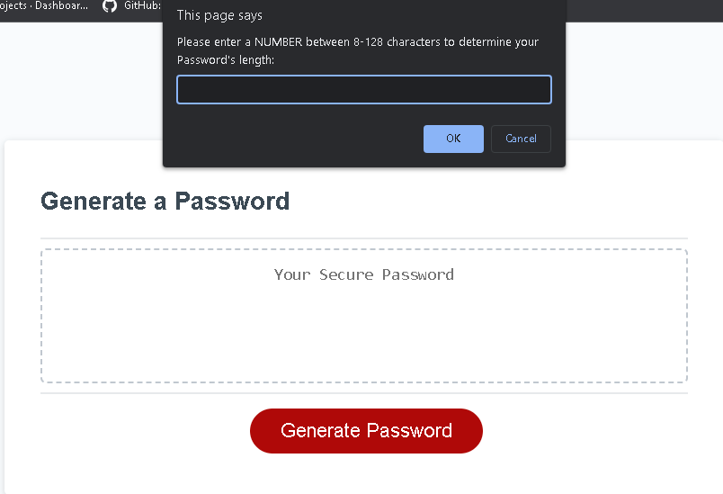
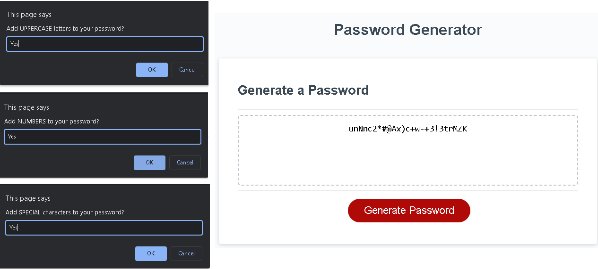
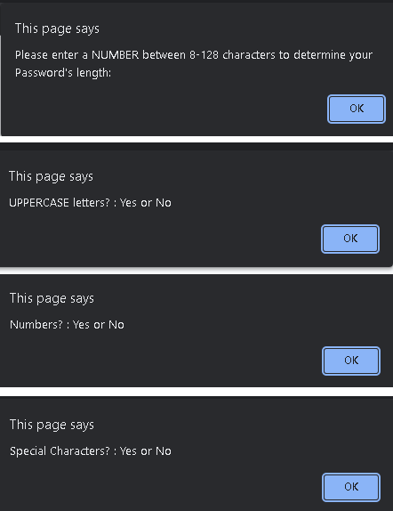

# Week-3-Challenge-Random-Password-Generator
Week 3 Challenge - Random Password Generator Project

## Random Password Generator
* Week 3's Challenge requires us to modify a starter code to create an application powered by Javascript that enables users to create a random password based on desired criteria. 
### Challenge Goals
* Present series of prompts for password critieria:
    * Uppercase, Lowercase, Numeric, and/or Special
    * Length of password
    * All selected critierias generated
* Generates password on page
* Once code base is complete we will have to deploy the application to a live URL and Github URL with new repository that satisfies repository criterias.

## Screenshot
1. Prompt when "Generate" selected

2. Series of Prompts to collect password criteria

3. Error screen (return back to question if proper value not provided)

## Status
*  Variables/Functions/Values/Parameters created to provide data.
*  Variables/Functions/Values/Parameters created to collect criteria data.
*  Functions created to gather all data through prompts.
*  Conditions provided and randomized to produce password.
*  URLs live

### Live Link
* Your site is live at 
https://louyoon89.github.io/WEEK-3-Challenge/
Last deployed by @github-pages github-pages
### Github Link
* https://github.com/louyoon89/WEEK-3-Challenge
